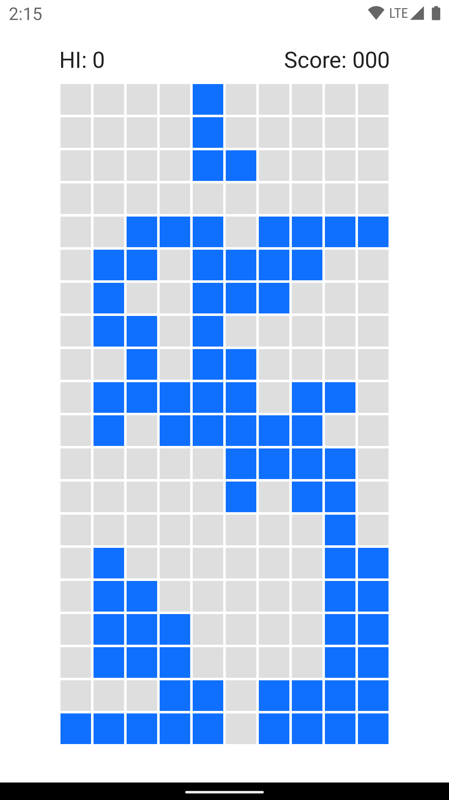

# RecyclerView，Compose like


**LazyRecycler** is a library that provides [LazyColumn](https://developer.android.com/reference/kotlin/androidx/compose/foundation/lazy/package-summary) like APIs to build lists with RecyclerView. 

### Quick start

Add the dependency [](https://maven-badges.herokuapp.com/maven-central/io.github.dokar3/lazyrecycler):

```groovy
implementation 'io.github.dokar3:lazyrecycler:latest_version'
```

Then create a list by using the `lazyRecycler()` function. Adapter, LayoutManager, DiffUtil, OnItemClickListener and more, these are **all in one** block:

```kotlin
lazyRecycler(recyclerView, spanCount = 3) {
    // Header
    item(layout = R.layout.header) {}

    // Create a section
    items(
        items = listOfNews,
        layout = ItemNewsBinding::inflate,
        clicks = { view, item ->
            // Handle item clicks
        },
        longClicks = { view, item -> 
            // Handle long clicks
            true
        },
        differ = {
            areItemsTheSame { oldItem, newItem ->
                oldItem.id == newItem.id
            }
            areContentsTheSame { oldItem, newItem ->
                oldItem.title == newItem.title && ...
            }
        },
        span = { position ->
            if (position % 3 == 0) 3 else 1
        },
    ) { binding, news ->
        // Bind item
    }
    
    // Some other sections
    items(...)
    items(...)
    
    // Footer
    item(layout = R.layout.footer) {}
}
```


# Basic

### Sections

In LazyRecycler, every `item` and `items` call will create a section, sections will be added to the Adapter by the creating order.

```kotlin
item(...) { ... }

items(...) { ... }
```

When creating a dynamic section, it's necessary to set a unique id to update the section later, or using reactive data sources may be a better choice (see the [Reactive data sources](#reactive-data-sources) section).

```kotlin
val recycler = lazyRecycler {
    items(
        items = news,
        layout = R.layout.item_news,
        id = SOME_ID,
    ) { ... }
}

// Update
recycler.updateSection(SOME_ID, items)
// Remove
recycler.removeSection(SOME_ID)
```

### Layout

```kotlin
// xml layout id
items(items = news, layout = R.layout.item_news) { ... }

// ViewBinding, DataBinding
items(items = news, layout = ItemNewsBinding::inflate) { binding, item -> ... }

// Instantiate views
items(items = news) { parent ->
    val itemView = NewsItemView(context)
    ...
    itemView
}
```

### Bind

For ViewBinding item/items:

```kotlin
items(items = news, layout = ItemNewsBinding::inflate) { binding, item ->
    binding.title.text = item.title
    binding.image.load(item.cover)
    ...
}
```

For DataBinding item/items:

```kotlin
items(items = news, layout = ItemNewsDataBinding::inflate) { binding, item ->
    binding.news = item
}
```

For layoutId item/items:

```kotlin
items(items = news, layout = R.layout.item_news) { view ->
    ...
    val tv: TextView = view.findViewById(R.id.title)
    bind { item ->
        tv.text = item.title
    }
}
```

For view instantiation item/items:

```kotlin
items(items = news) { parent ->
    val itemView = CustomNewsItemView(context)
    bind { item ->
        itemView.title(item.title)
        ...
    }
    itemView
}
```

### Generics

```kotlin
items<I>(items = news, layout = layoutId) { ... }
items<V, I>(items = news, layout = ItemViewBinding::inflate) { ... }
items<I>(items = news) { ... }
```

* `I` for item type
* `V` for the View Binding

In most cases, the compiler is smart enough so type parameter(s) can be omitted.

### LayoutManager

LazyRecycler creates a LinearLayoutManager by default, if `spanCount`  > 1, GridLayoutManager will be used,  to skip the LayoutManager setup, set `setupLayoutManager` to `false`:

```kotlin
lazyRecycler(
    recyclerView,
    setupLayoutManager = false,
) { ... }
....
recyclerView.layoutManager = YourOwnLayoutManager(...)
```

`span` is used to define `SpanSizeLookup` for GridLayoutManager:

```kotlin
items(
    ...,
    span = { position ->
        if (position == 0) 3 else 1 
    },
) {
    ...
}
```


# Reactive data sources

To support reactive data sources like `Flow`, `LiveData`, or `RxJava`, add the dependencies:

```groovy
// Flow
implementation 'io.github.dokar3:lazyrecycler-flow:latest_version'
// LiveData
implementation 'io.github.dokar3:lazyrecycler-livedata:latest_version'
// RxJava3
implementation 'io.github.dokar3:lazyrecycler-rxjava3:latest_version'
```

Latest version: [](https://maven-badges.herokuapp.com/maven-central/io.github.dokar3/lazyrecycler)

### Flow

```kotlin
val entry: Flow<I> = ...
item(data = entry.toMutableValue(coroutineScope), ...) { ... }

val source: Flow<List<I>> = ...
items(data = source.toMutableValue(coroutineScope), ...) { ... }
```

### LiveData

```kotlin
val entry: LiveData<I> = ...
item(data = entry.toMutableValue(lifecycleOwner), ...) { ... }

val source: LiveData<List<I>> = ...
items(data = source.toMutableValue(lifecycleOwner), ...) { ... }
```

### RxJava

```kotlin
val entry: Observable<I> = ...
item(data = entry.toMutableValue(), ...) { ... }

val source: Observable<List<I>> = ...
items(data = source.toMutableValue(), ...) { ... }
```


### Observe/stop observing data sources:

LazyRecycler will observe the data sources automatically after attaching to the RecyclerView, so it's no necessary to call it manually. But there is a function call if really needed:

```kotlin
recycler.observeChanges()
```

When using a RxJava data source or a Flow data source which was not created by the `lifecycleScope`, should stop observing data sources manually to prevent leaks:

```kotlin
recycler.stopObserving()
```


# Advanced

### Alternate sections

Use `template()`  to reuse bindings:

```kotlin
lazyRecycler {
    // layout id template
    val sectionHeader = template<String>(R.layout.section_header) {
        // Bind item
        bind { ... }
    }
    // ViewBinding template
    val normalItem = template<Item>(ItemFriendBubbleBinding::inflate) { binding, item ->
        // Bind item
    }
    
    item(item = "section 1", template = sectionHeader)
    items(items = someItems, template = normalItem)
    
    item(item = "section 2", template = sectionHeader)
    items(items = otherItems, template = normalItem)
    ...
}
```

### Single items with multiple view types

Use `template()` + `extraViewTypes`: 

```kotlin
lazyRecycler {
    val friendBubble = template<Message>(ItemFriendBubbleBinding::inflate) { binding, msg ->
        // Bind alternative items
    }
    
    items(
        items = messages,
        layout = ItemOwnerBubbleBinding::inflate,
        extraViewTypes = listOf(
            ViewType(friendBubble) { position, item -> /* predicate */ },
        ),
    { binding, msg ->
        // Bind default items
    }
    ...
}
```

### Add new sections dynamically

Use `recycler.newSections()`:

```kotlin
val recycler = lazyRecycler { ... }
recycler.newSections {
    item(...) { ... }
    items(...) { ... }
    ...
}
// If new sections contain any observable data source
recycler.observeChanges()
```

### Build list in background

```kotlin
backgroundThread {
    // Do not pass RecyclerView to the lazyRecycler()
    val recycler = lazyRecycler {
        ...
    }
    uiThread {
        recycler.attachTo(recyclerView)
    }
}
```


# Demos

### 1. Multiple sections

|  |  |
| :------------------------------: | :------------------------------------: |
|               Day                |                 Night                  |

### 2. Chat screen

|  |  |
| :---------------------------: | :---------------------------------: |
|              Day              |                Night                |

### 3. Tetris game (Just for fun)

|  |  |
| :-----------------------------: | :-----------------------------------: |
|               Day               |                 Night                 |


# Links

* [Jetpack Compose](https://developer.android.com/jetpack/compose)
* [LazyColumn](https://developer.android.com/reference/kotlin/androidx/compose/foundation/lazy/package-summary#lazycolumn)
* [square/cycler](https://github.com/square/cycler)


# License

[Apache License 2.0](./LICENSE.txt)
